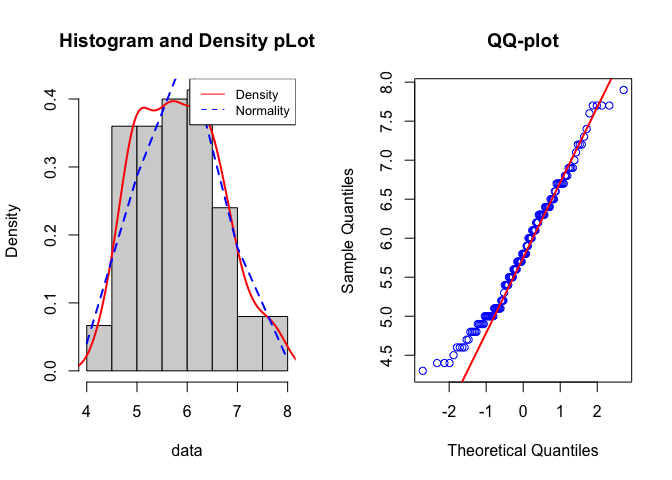

# checkdata

<!-- badges: start -->
<!-- badges: end -->

## Package discription
This `checkdata` data package is built to evaluate whether a vector of normally distributed by two methods:
1. Visualization 
    - Histogram
    - QQ-plot 
2. The Shapiro-Wilk test
    - by looking at the p-value based on the user-defined level of significance

## Package set up 
1. Create a new project in Rstudio and specify the project type as a package in the local Rstudio environment.  

2. Generate a README file by `use_readme_md()` 

3. Generate a LICENSE file by the `use_mit_license("Shuyi Tan")` 

4. Wrap my **normarlity_test()** function into a R script named **normality.R** and save it in the R folder.  

5. Generate a test folder by the function `use_test("my-test")` 

6. Make a vignette by `usethis::use_vignette("Vignette")`

7. Document the files by `devtools::document()`

6. Create a remote repository in github.com and named as "checkdata"  

7. Run the following command to push the local package framework to the "checkdata" repo  
    - Initialize the local project as a Git repository: `git init_`  
    - Add the files to my new local repository: `git add .`
    - Commit the files: `git commit -m "initial commit"`
    - Push the local repo to the remote repo: `git remote add origin https://github.com/yelselmiao/checkdata` and `git remote -v` 
    - Push the changes to the remote repo: `git push -f origin master`
  
## Package installation
The package can be installed by running the following line:  
``` r
devtools::install_github("yelselmiao/checkdata")`
```

## Basic usage and example
``` r
library(checkdata)`
```

For example, if we would like to check if the **mpg** column in the **mtcars** dataset is normal, we may check it like this:

``` r
data("mtcars")
normarlity_test(mtcars$mpg)
#> "You data is normal,because your p_value = 0.122881358539443 > 0.05"
```



`
