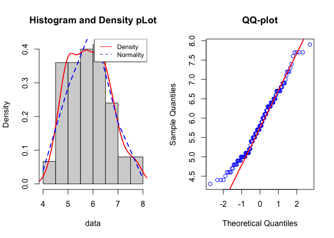

Vignette
================

``` r
devtools::install_github("yelselmiao/checkdata")
library(checkdata)
```

We will run the function on the R built-in dataset **iris**, which
contains the measurements in centimeters of the variables sepal length
and width and petal length and width, respectively, for 50 flowers from
each of 3 species of iris. You can find a more detailed description
[here](https://stat.ethz.ch/R-manual/R-devel/library/datasets/html/iris.html).

To see whether the column/variable `Sepal.Length` is normal, let’s run
it through the normarlity\_test() function.

``` r
normarlity_test(iris$Sepal.Length,alpha=0.05,plotting = TRUE,verbose=TRUE)
#> Test in progress...
```

<!-- -->

    #> [1] "You data is not normal,because your p_value = 0.0101811611756293 <= 0.05"
